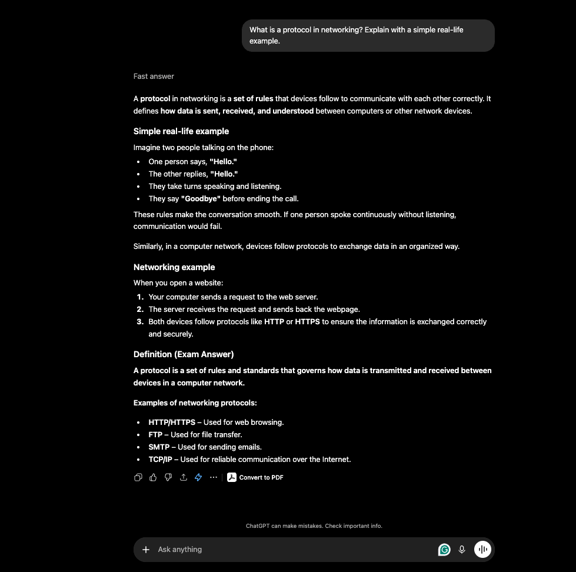
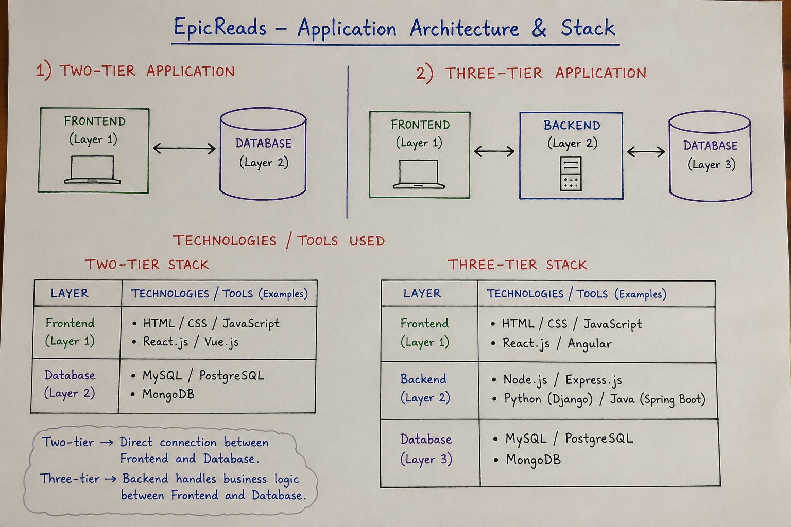
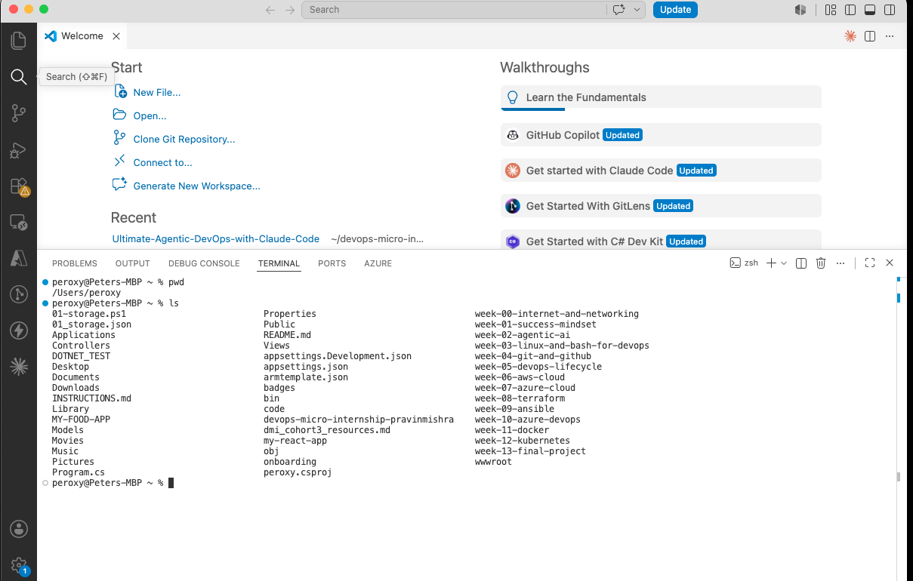

# Week 00 - Internet and Networking

Part of the DevOps Micro Internship (DMI) Cohort 3 with Agentic AI

---

# 🧑‍💻 Task 1: Using ChatGPT as Your Learning Assistant

## Scenario

You're new to DevOps and will frequently encounter technical questions. ChatGPT can be your learning companion.

## Your Task

Write a clear ChatGPT prompt to help you understand:

> "What is a protocol in networking? Explain with a simple real-life example."

Take a screenshot of your interaction showing:

* Your detailed prompt (with clear expectations)
* ChatGPT's simplified response with an example

## Screenshot

Save your screenshot in the `screenshots` folder and update the file name below.




Replace `task-1-chatgpt.png` with your actual screenshot file name.

---

## What I Learned (2–3 lines)

Add your answer here...

Without protocols internet operations are boud to fail. Protocols in networking is a set of rule that devices follows to communicate with each other directly. examples of this protocols are HTTP,HTTPS, FTP, SMTP, TCP.

# 🌐 Task 2: Internet and Networking

## Scenario

Your friend is launching an online bookstore named **EpicReads**.

He asked you to explain how users globally can access his website hosted in Finland.

## Your Task

Write a short explanation (**100–150 words**) that includes:

* Packet Switching
* IP Address
* TCP/IP
* HTTP/HTTPS

💡 **Tip:** You may use ChatGPT (as demonstrated in Task 1) to refine your explanation.

## Answer

Add your answer here...

When a user visits EpicReads from anywhere in the world, their web browser sends a request to the bookstore's server in Finland using  HTTP or HTTPS, with HTTPS providing a secure, encrypted connection. The website is identified on the internet by its unique IP ADDRESS, which allows data to be sent to the correct server. The TCP/IP protocol suite manages the communication by breaking the data into small packets, ensuring they are delivered reliably and reassembled correctly at the destination. This process uses packet switching, where each packet may travel through different network routes before reaching the server or the user's device. Together, these technologies enable customers around the world to access EpicReads quickly, accurately, and securely.


# 🏗️ Task 3: Application Architecture & Stack

## Scenario

EpicReads bookstore has two application versions:

### Two-Tier Application

* Frontend
* Database

### Three-Tier Application

* Frontend
* Backend
* Database

## Your Task

* Draw simple diagrams (hand-drawn or tool-based such as draw.io)
* Label each layer clearly
* List at least two common technologies or tools used for each layer
* Submit a screenshot or photo clearly showing your own drawing

## Diagram Screenshot / Photo

Save your diagram image in the `screenshots` folder and update the file name below.




Replace `task-3-diagram.png` with your actual diagram file name.

---

## Technologies Used

### Frontend

* HTML
* CSS

### Backend

* Node.js
* Python

### Database

* MySql
* PostgreSQL

---

# 🌍 Task 4: Domain Name & DNS (Basic Concepts)

## Scenario

Your friend's bookstore **EpicReads** is currently accessible through:

```text
52.172.142.222:3000
```

He purchased the domain:

```text
epicreads.com
```

## Your Task

In **50–100 words**, explain in your own words:

1. What is DNS (Domain Name System)?
2. Which DNS record type should be used to connect the domain to the given IP, and why?

## Answer

The Domian Name System (DNS) is like the internet's phonebook. It translates easy-to-remember domain names, such as EPICREADS.COM, into IP addresses that computers use to locate websites. To connect epicreads.com to the IP address 52.172.142.222, an A record should be used because it maps a domain name directly to an IPv4 address. This allows users to access the website by typing epicreads.com instead of remembering the numerical IP address.


---

# 💻 Task 5: Visual Studio Code Setup (Hands-on)

## Your Task

Install Visual Studio Code (if not already installed).

Take a screenshot of your VS Code environment showing:

* Terminal open inside VS Code
* Running a basic command:

### Windows

```powershell
dir
```

### Linux / macOS

```bash
pwd
ls
```

* Your selected VS Code theme clearly visible

⚠️ **Important:** The screenshot must show your username or another identifiable detail to confirm it is your environment.

## Screenshot

Save your screenshot in the `screenshots` folder and update the file name below.




Replace `task-5-vscode.png` with your actual screenshot file name.

---

# 🔗 Task 6: Publish Your Assignment as a LinkedIn Post

## Objective

Publishing on LinkedIn helps you:

* Build your professional online presence
* Reinforce your learning
* Document your DevOps journey publicly

## Your Task

Summarize your answers from Tasks 1–5 into a LinkedIn post.

Clearly structure your post into the following sections:

* ChatGPT
* Internet & Networking
* App Architecture
* DNS
* VS Code Setup

Add the following credit note at the end of your post:

> **P.S. This post is a part of DevOps Micro Internship with Agentic AI Cohort-3 by Pravin Mishra. You can start your DevOps journey by joining this Discord community: https://discord.pravinmishra.com/**

---

## LinkedIn Post URL

Paste your LinkedIn post URL here:

```text
Add your URL here...
```

https://www.linkedin.com/posts/ogbebor-peter-304714109_week-0-complete-building-my-cloud-networking-share-7484908993438494720-eEON/?utm_source=share&utm_medium=member_desktop&rcm=ACoAABtWEbQBVvapHtdERI7aOs2eM5g9kkTrmYs

## LinkedIn Post Backup Copy

Paste the full text of your LinkedIn post here:

Add your post content here...

https://www.linkedin.com/posts/ogbebor-peter-304714109_week-0-complete-building-my-cloud-networking-share-7484908993438494720-eEON/?utm_source=share&utm_medium=member_desktop&rcm=ACoAABtWEbQBVvapHtdERI7aOs2eM5g9kkTrmYs

# Reflection – Week 0

### What did you find easy?

Add your answer here...

I found it easy to understand the basic networking concepts, such as protocols, IP addresses, packet switching, and the differences between two-tier and three-tier application architectures. I also understood how DNS works and why domain names are used instead of IP addresses.

### What was difficult?

Add your answer here...

The most challenging part was understanding how all the networking components work together behind the scenes when a user accesses a website. I also needed more time to fully understand the roles of different DNS record types and application layers.

### What will you improve next week?

Add your answer here...

Next week, I will spend more time practicing networking concepts, especially DNS configuration and application architecture. I also plan to build a simple web application and explore how the frontend, backend, and database communicate in a real-world environment.

## 📌 About DMI & CloudAdvisory

DevOps Micro Internship (DMI) is a project-based DevOps program run by Pravin Mishra (The CloudAdvisory) focused on real-world execution, systems thinking, and career readiness.

It helps learners build strong DevOps foundations with hands-on experience.


## 📌 Resources

- 🌐 **DMI Official Website:** https://pravinmishra.com/dmi  
- 🎓 **DevOps for Beginners (Udemy):** https://www.udemy.com/course/devops-for-beginners-docker-k8s-cloud-cicd-4-projects/  
- 🎓 **Ultimate Agentic AI DevOps with Clude Code** https://www.udemy.com/course/ultimate-agentic-ai-devops-with-claude-code/?referralCode=448389767BC96284087B
- 🎓 **DevOps with Claude Code: Terraform, EKS, ArgoCD & Helm** https://www.udemy.com/course/devops-with-claude-code-terraform-eks-argocd-helm/?referralCode=1C5B734505D65A010FA3
- ▶️ **YouTube Playlist (DMI Cohort 3):** https://www.youtube.com/playlist?list=PLFeSNDtI4Cho  
- 🔗 **Pravin Mishra (LinkedIn):** https://www.linkedin.com/in/pravin-mishra-aws-trainer/  
- 🏢 **CloudAdvisory (LinkedIn):** https://www.linkedin.com/company/thecloudadvisory/

---

*This submission is part of DevOps Micro Internship (DMI) Cohort 3 — Agentic AI Track*