# Assignment 3 — Production Maintenance Drill (OPS Checklist)

Part of the DevOps Micro Internship (DMI) Cohort 3 with Agentic AI

---

## Purpose

In this assignment, you will treat your already deployed React application (on Ubuntu VM with Nginx) as a live production system. You will perform structured operational checks covering network validation, service health, log analysis, resource monitoring, configuration verification, and incident simulation with recovery — mirroring real on-call DevOps responsibilities.

---

# Task 1 — Server Access & Networking Validation

## Goal

Verify that the deployed React application is reachable from the browser and confirm basic network connectivity of the Ubuntu VM.

### Evidence

#### Screenshot 1 — Browser showing the React app with your Full Name visible on the UI

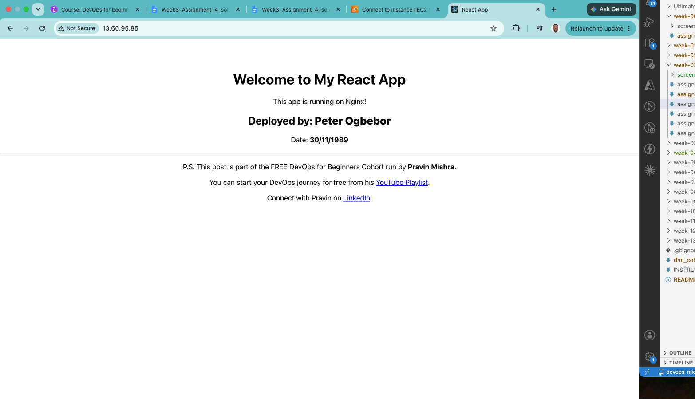

#### Screenshot 2 — Output of `ip a`

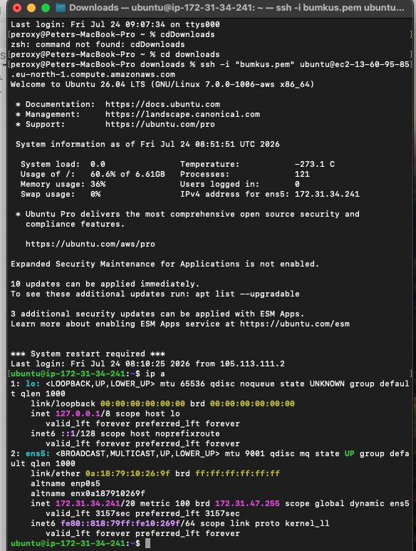

#### Screenshot 3 — Output of `sudo ss -tulpen`

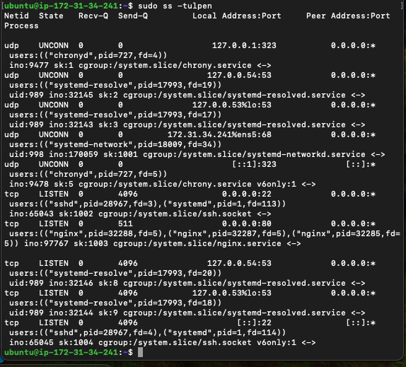

#### Screenshot 4 — Output of `sudo ufw status`

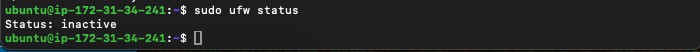

---

### Notes

Answer the following in your own words:

**1. What proves Nginx is listening on 0.0.0.0:80?**

TCP LISTEN means the socket is open and accepting connections. Local Address:Port of 0.0.0.0:80 means it's bound to all interfaces (not just localhost) on port 80. The Process field ties it directly to nginx (three worker PIDs sharing the listening socket, as nginx does with its master + worker model).

**2. What proves SSH is active on port 22?**

tcp    LISTEN  0       4096                 0.0.0.0:22            0.0.0.0:*      users:(("sshd",pid=28967,fd=3),("systemd",pid=1,fd=113))                        ino:65043 sk:1002 cgroup:/system.slice/ssh.socket <->                 

TCP LISTEN on 0.0.0.0:22 (IPv4) and :22 (IPv6) means it's accepting connections on port 22 across all interfaces, both address families. The Process field names sshd (pid 28967) as the owner, with systemd (pid 1) also attached via ssh.socket — that's socket activation, where systemd holds the listening socket and can spawn/hand off to sshd. The cgroup:/system.slice/ssh.socket confirms it's managed by the systemd unit for SSH.

**3. Did you find any unexpected open ports? Explain briefly.**

Everything in the output  is a standard, expected service and each one is bound accordingly. port 22 and port 80 are bound to 0.0.0.0, meaning that they are intentionally reachable from outside, this is ecpected for a server running ssh and a web service. Port 323 and port 53 are both bound to 127.0.0.1, 127.0.0.53. this are only reachable internally which is correct and safe.

# Task 2 — Service Health & Systemd Validation (Nginx)

## Goal

Verify that Nginx is properly installed, running, enabled at boot, and safely configured.

### Evidence

#### Screenshot 1 — Output of `systemctl status nginx --no-pager`

---

#### Screenshot 2 — Output of `sudo nginx -t`

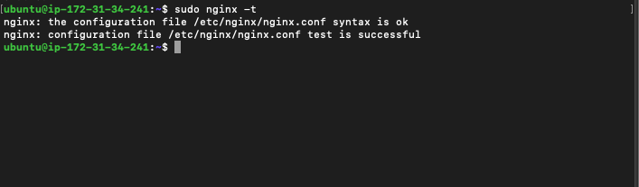

---

#### Screenshot 3 — Output of `sudo ss -lptn '( sport = :80 )'`

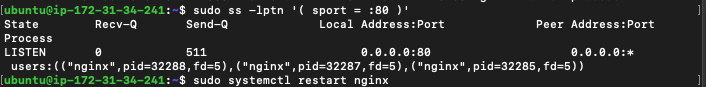

---

### Notes

Answer the following in your own words:

**1. What happens if Nginx fails to restart in production?**

If systemctl restart nginx fails, systemd stops the old master process before confirming the new one started — so nginx typically goes down, not into some safe fallback state. Port 80 stops listening entirely, so all incoming HTTP traffic gets connection refused until nginx is back up. If nginx is a reverse proxy in front of other services, everything behind it becomes unreachable too, even if those backend services are healthy.

systemctl status nginx would show Active: failed rather than running, and journalctl -u nginx would have the actual error — most often a config syntax error, a port already in use by another process, a missing permission-denied file (certs, log paths), or a worker failing to bind.

That's why nginx -t before restarting matters, it validates config syntax without touching the running service, catching the most common failure cause before you risk downtime. Given the test above passed cleanly and the restart succeeded, this instance is in good shape, but on a system where uptime matters it's worth having monitoring/alerting on nginx.service state changes, since a failed restart otherwise just sits down until someone notices.

---

**2. What's your basic rollback plan?**

A simple, practical rollback for a failed nginx restart:

Before restarting, back up the config: sudo cp -r /etc/nginx /etc/nginx.bak-$(date) or better, keep configs in git so you can diff/revert. Always run nginx -t first — if it fails, don't restart at all; fix or revert the config and test again.

If you restart and it fails anyway, first check journalctl -u nginx -n 50 to see the actual error. If it's a bad config, restore the backup (sudo cp -r /etc/nginx.bak-.../* /etc/nginx/), run nginx -t again, then systemctl restart nginx.

If the config's fine but something else broke (port conflict, bad cert path), you can fall back to just starting the old binary manually or restarting again once the conflicting resource is freed — sudo ss -tulpen | grep :80 to check what's holding the port.

For zero-downtime changes going forward, use systemctl reload nginx instead of restart where possible — it re-reads config without dropping the listening socket, so a bad reload leaves the old workers running instead of taking the site down.

The core idea is test before you touch it, keep a known-good config backup, and know your rollback command before you run the change not after it breaks.

---

# Task 3 — Logs & Request Trace

## Goal

Verify real traffic flow and analyze logs to understand system behavior and errors.

### Evidence

#### Screenshot 1 — Output of `sudo tail -n 30 /var/log/nginx/access.log`

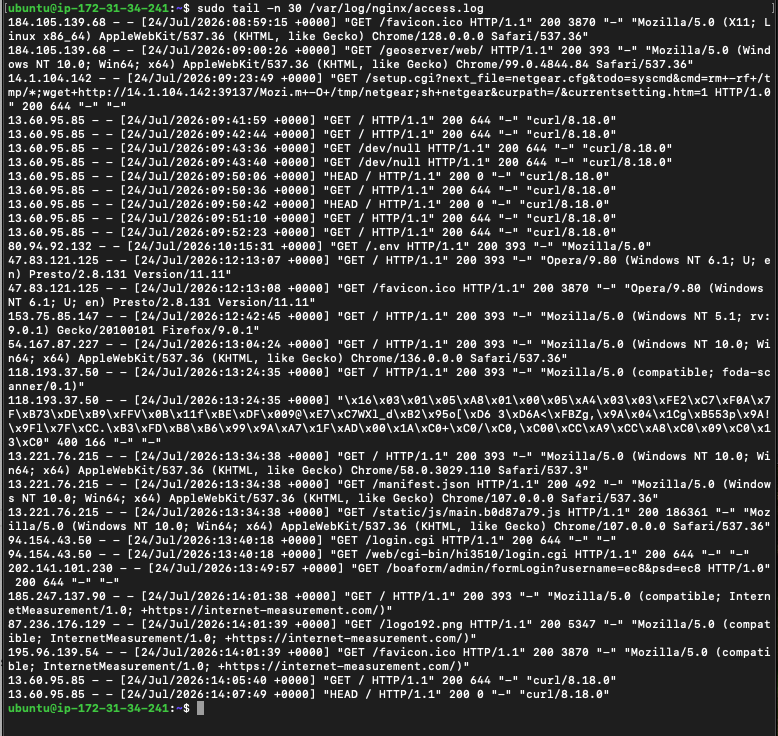

---

#### Screenshot 2 — Output of `sudo tail -n 30 /var/log/nginx/error.log`

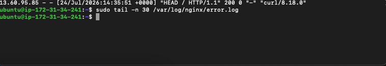

---

#### Screenshot 3 — Output of `sudo journalctl -u nginx --no-pager -n 50`

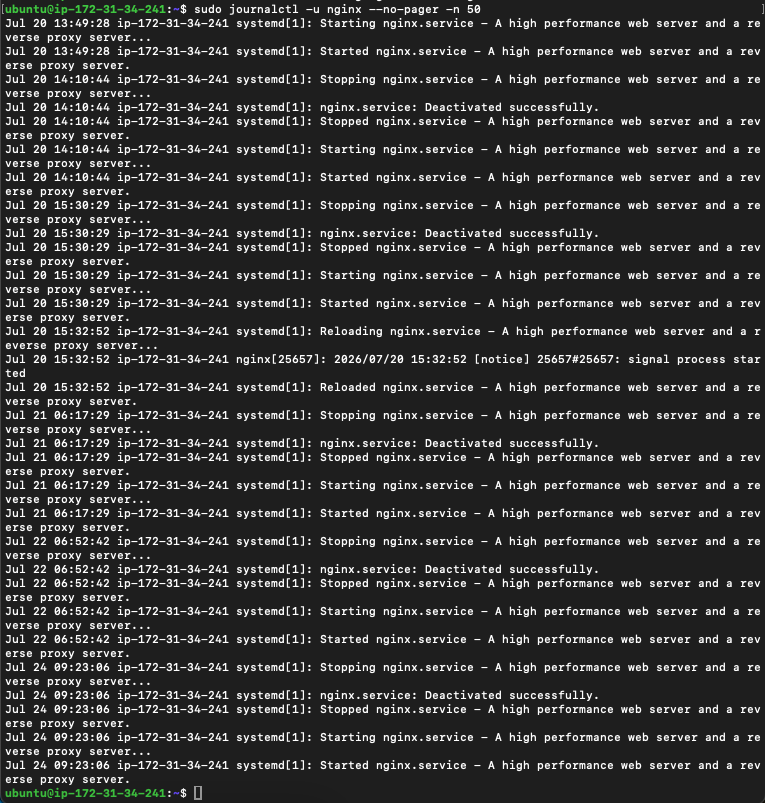

---

### Notes

Answer the following in your own words:

**1. Were there any errors in the logs?**

- If yes, mention 1–2 example error lines from the logs and explain what each one means in simple terms.
- If no, explain what it means if the error log is empty or shows no recent errors during your check.

There were no errors recorded.The output here is empty no lines returned at all. That's a good sign, it means nginx hasn't logged any internal errors recently. 

**2. If there were no errors, what does that indicate about the system?**

An empty error log indicates the nginx process itself is healthy and stable, no crashes, no config problems, no permission failures and no worker process failures during that period.

**3. Based on the access logs, were your curl requests visible in the log entries? What does that prove about traffic flow?**

Yes clearly visible. Lines like these are for requests, examples below ;
13.60.95.85 - - [24/Jul/2026:09:41:59 +0000] "GET / HTTP/1.1" 200 644 "-" "curl/8.18.0"
13.60.95.85 - - [24/Jul/2026:09:42:44 +0000] "GET / HTTP/1.1" 200 644 "-" "curl/8.18.0"

what this proves about traffic flow is that the full request path is working end to end. the request left my machine and reached the servers public ip on port 80.

# Task 4 — System Resource Health Check (Capacity Red Flags)

## Goal

Assess server capacity and detect potential performance or failure risks.

### Evidence

#### Screenshot 1 — Output of `uptime`

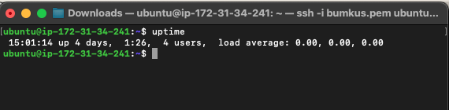

---

#### Screenshot 2 — Output of `free -h`

---

#### Screenshot 3 — Output of `df -h`

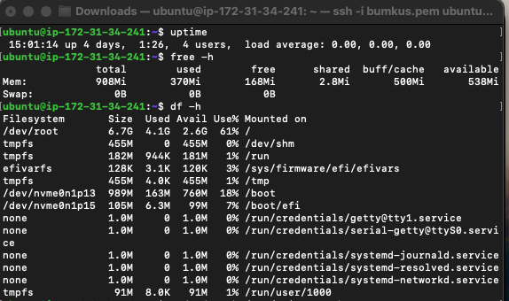

---

#### Screenshot 4 — Output of `sudo du -sh /var/* | sort -h`

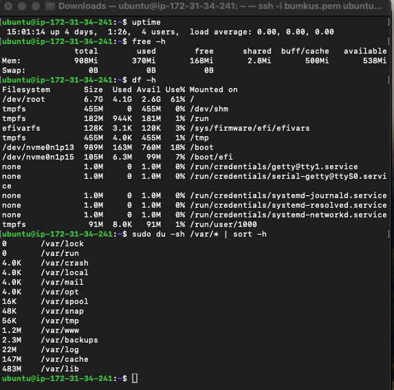

---

### Notes

Answer the following in your own words:

**1. Which resource looks most critical right now? (CPU/load, memory, or disk) Explain why.**

Memory is the one to watch, though nothing is in danger territory yet.

Memory is the tightest resource for 2 reasons. firstly the total ram size is 908 mi which is very small.so there is little room to arbsorb spikes from a new process. secondly Available shows 538MI so its not near the edgebut the margin for error is thingiven the total size and missing swap.

**2. What happens if disk becomes 100% full in a production server?**

Database are vulnerable because data file can get currupt or crash in the middle of a transaction. Service system can break in ways that are hard to diagonise. Nginx can no longer write logs. it may stall on writes,drop requests opr in some configs it may not be able to start or reload entirely because it cant open log files

# Task 5 — Configuration & Deployment Verification

## Goal

Ensure the correct React build is deployed and Nginx is serving it properly.

### Evidence

#### Screenshot 1 — Output of `ls -lah /var/www/html | head -n 20`

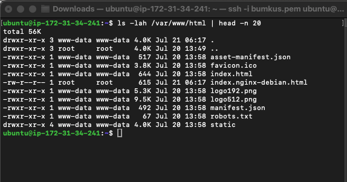

---

#### Screenshot 2 — Output of `grep -R "Deployed by" -n /var/www/html 2>/dev/null | head`

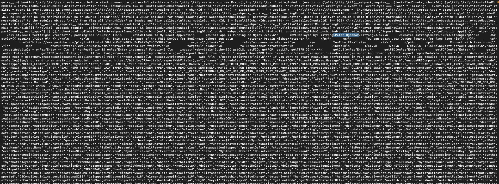

---

#### Screenshot 3 — Output of `grep -n "try_files" /etc/nginx/sites-available/default`

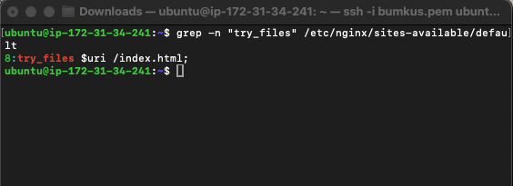

---

### Notes

Answer the following in your own words:

**1. How do you confirm that the correct version of the application is deployed?**

This is simply achieved by grepping for "Deployed by: PETER OGBEBOR" in the deployed bundle 

# Task 6 — Nginx Configuration Failure Simulation

## Goal

Simulate a real-world Nginx misconfiguration and recover the service safely.

### Evidence

#### Screenshot 1 — Output of `sudo nginx -t` showing the syntax error (broken config)

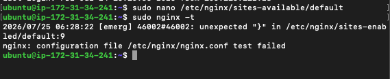

---

#### Screenshot 2 — Output of `sudo nginx -t` showing syntax ok (fixed config)

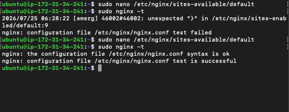
---

#### Screenshot 3 — Output of `curl -I http://<public-ip>` confirming recovery (200 OK)

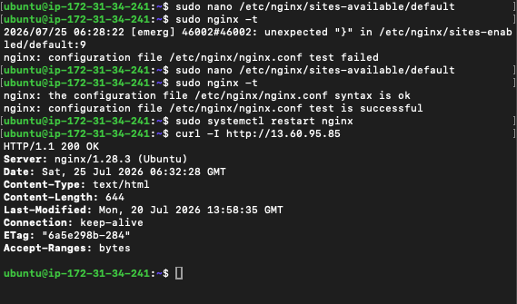]

---

### Notes

Answer the following in your own words:

**1. What caused the configuration failure?**

Its a syntax error. the missing semicolon on the line before -nginx.it misparses where the blocks end

---

**2. How did you fix the issue?**

I corrected the directive by adding the semicolon. after doing this the nginx -t passed clean afterward 

---

**3. How can you avoid this kind of issue in real production systems?**

Always run Niginx -t before reloading or restating. 
Edit on a staging/duplicate config first, or edit a copy and diff it against the live file, rather than editing sites-available/default directly on a running production box.
Use systemctl reload instead of restart once the config is valid — reload re-reads config without dropping connections, so a bad config never takes the server down in the first place (since nginx -t runs as part of reload and reload just fails safely if it's invalid).

---

# Task 7 — Web Application Failure Simulation

## Goal

Simulate missing deployment content and recover the application safely.

### Evidence

#### Screenshot 1 — Output of `curl -I http://<public-ip>` showing failure (non-200 response)

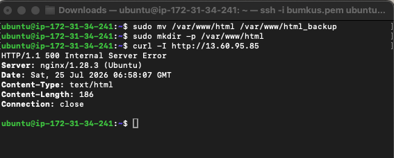

---

#### Screenshot 2 — Output of `curl -I http://<public-ip>` confirming recovery (200 OK)

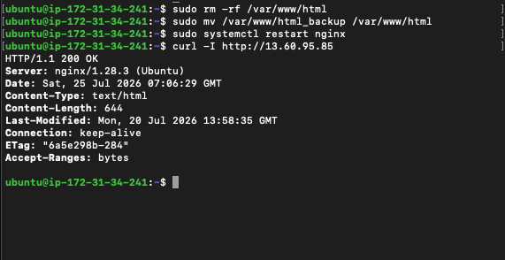

---

### Notes

Answer the following in your own words:

**1. What caused the application to break in this scenario?**

the app didn't break from a config or code bug, it broke because its document root got emptied out. So requests fail and nginx returns a 500 instead of content.

---

**2. How did you fix the issue and restore the application?**

The backup file was moved and I restarted the nginx and the http response 200 ok 

---

**3. What steps would you take to prevent this kind of issue in real production systems?**

The root file is a very important file. its resonable to always make sure you have back up of the root file. its also important to deploy new content on a seperate directory. Test changes on a staging path or server first and only move to production once its verified. add a health check after any deploy.

---

# Task 8 — Security & Reliability Review

## Goal

Review and reflect on the security and reliability practices applied during this assignment.

### Security & Reliability Notes

Answer the following in your own words:

**1. Why is SSH key-based authentication more secure than sharing passwords?**

SSH key-based auth relies on a public/private key pair instead of a shared secret. The private key never leaves your machine, so there's nothing transmitted over the network that an attacker could intercept and reuse — unlike a password, which travels (even if hashed/encrypted) and can be captured, guessed, or brute-forced.

---

**2. Why should only required ports be open on a production server?**

Only the ports a server actually needs should be open because every open port is a potential entry point for attackers. Automated scanners constantly probe the internet for open ports, so anything left exposed unnecessarily  even by accident  will eventually be found and tested for weaknesses. Unused or forgotten services are especially risky since they're rarely patched or monitored, and may still have default logins or no authentication at all, giving an attacker an easy way in even if the main application is secure. Keeping only essential ports open (like 22 for SSH, and 80/443 for web traffic) reduces the attack surface, limits how far an attacker can move if one service is compromised, and makes it much easier to monitor traffic and spot anything suspicious.

---

**3. Why is it important for Nginx to be enabled on boot?**

It's important because if a server reboots, whether from a crash, update, or power issue and Nginx isn't set to start automatically, the website will stay down until someone manually logs in and starts it. Enabling Nginx on boot means it restarts on its own as soon as the system comes back up, so the site recovers without needing anyone to notice and fix it manually. This is especially important for production servers, where downtime should be minimized and constant manual monitoring isn't realistic

---

**4. What are the risks of sharing secrets, keys, or credentials publicly?**

Sharing secrets, keys, or credentials publicly like accidentally posting them in a public code repository gives attackers direct access without them having to do any real hacking. Automated bots constantly scan the internet for exposed keys and can exploit them within minutes of being posted. This can lead to full account or system compromise, unauthorized access to sensitive data, and in cloud environments, attackers may run up huge costs by using the exposed credentials to create resources like mining servers. A single leaked credential can also open the door to other connected systems, especially if passwords are reused. Because of this, once a secret is exposed, it should be treated as compromised immediately and changed, and best practice is to never hardcode credentials in code instead store them securely using environment variables or a secrets manager.

---

**5. Why should cloud resources be stopped or terminated when they are no longer needed?**

Cloud resources should be stopped or terminated when no longer needed mainly to avoid unnecessary costs most cloud providers charge for resources as long as they're running, even if nobody is actively using them, so idle servers or services quietly rack up charges over time. Leaving unused resources running also increases security risk, since every active instance is a potential target that needs patching and monitoring, and forgotten resources are less likely to be kept up to date. It also helps keep the cloud environment organized and easier to manage, since unused resources can create confusion about what's actually in use and make troubleshooting or auditing more difficult.

---

# LinkedIn Post (Required)

## Evidence

#### LinkedIn Post URL

Paste your LinkedIn post URL here:

https://www.linkedin.com/posts/ogbebor-peter-304714109_standardizing-production-readiness-on-call-ugcPost-7486696654675456000-erVq/?utm_source=share&utm_medium=member_desktop&rcm=ACoAABtWEbQBVvapHtdERI7aOs2eM5g9kkTrmYs

---

#### Screenshot — Published LinkedIn post

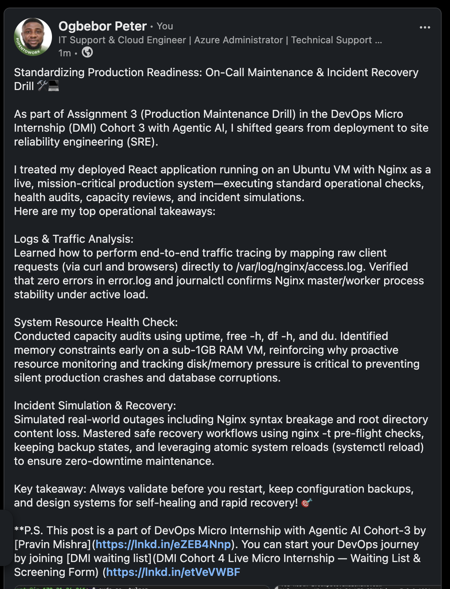

---

# Submission Instructions

- Add all required screenshots in your submission
- Full name must be visible in required screenshots
- Do not expose sensitive information (keys, passwords, account IDs)

---

# Completion Checklist

- [ ] Task 1: Screenshots (browser, ip a, ss -tulpen, ufw status) + Notes answered
- [ ] Task 2: Screenshots (nginx status, nginx -t, ss port 80) + Notes answered
- [ ] Task 3: Screenshots (access log, error log, journalctl) + Notes answered
- [ ] Task 4: Screenshots (uptime, free -h, df -h, du -sh) + Notes answered
- [ ] Task 5: Screenshots (ls html, grep deployed by, grep try_files) + Notes answered
- [ ] Task 6: Screenshots (nginx -t fail, nginx -t pass, curl recovery) + Notes answered
- [ ] Task 7: Screenshots (curl failure, curl recovery) + Notes answered
- [ ] Task 8: Security & Reliability Notes answered
- [ ] LinkedIn post published and URL submitted
- [ ] Full Name visible in all required screenshots
- [ ] No sensitive data exposed

---

## 📌 About DMI & CloudAdvisory

DevOps Micro Internship (DMI) is a project-based DevOps program run by Pravin Mishra (The CloudAdvisory) focused on real-world execution, systems thinking, and career readiness.

It helps learners build strong DevOps foundations with hands-on experience.

---

## 📌 Resources

- 🌐 DMI Official Website: https://dmi.pravinmishra.com?utm_source=github&utm_medium=readme  
- 🎓 University: https://university.pravinmishra.com?utm_source=github&utm_medium=readme  
- 💬 Discord Community: https://discord.pravinmishra.com?utm_source=github&utm_medium=readme  
- 📝 Blog: https://dmi.pravinmishra.com/blog?utm_source=github&utm_medium=readme  
- ▶️ YouTube Playlist: https://www.youtube.com/playlist?list=PLFeSNDtI4Cho  
- 🔗 Pravin Mishra (LinkedIn): https://www.linkedin.com/in/pravin-mishra-aws-trainer/  
- 🏢 CloudAdvisory (LinkedIn): https://www.linkedin.com/company/thecloudadvisory/

---

*This submission is part of DevOps Micro Internship (DMI) Cohort 3 — Agentic AI Track.*