# Assignment 5 — Bash Script Automation Drill (OPS Checklist)

Part of the DevOps Micro Internship (DMI) Cohort 3 with Agentic AI

---

## Purpose

In this assignment, you will practice Bash scripting by building a series of small automation scripts covering environment setup, variables, arrays, loops, file conditionals, if-else logic, and functions. These scripts form the foundation of real-world Linux automation used in DevOps, cloud, and production support environments.

---

# Task 1 — Bash Environment & Workspace Setup

## Goal

Verify that Bash is available on your system and create a clean workspace for this assignment.

### Evidence

#### Screenshot 1 — Output of `echo $SHELL` and `bash --version`

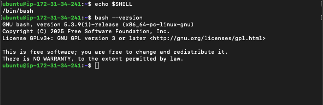

---

#### Screenshot 2 — Output of `pwd` and `ls -lah` showing the scripts directory

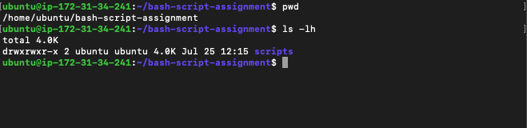

---

### Notes

Answer the following in your own words:

**1. What is Bash?**

Bash is a command-line interpreter and shell scripting language. It acts as the text-based interface between you and your computer's operating system.

---

**2. What is the difference between shell and Bash?**

shell is s broad category of programs that serve as a text-based user interface, interpreting commands typed by a user and passing them to the operating system's kernel.

Bash is specific, popular implementation of a shell (Bourne Again SHell), created in 1989 as an enhanced, open-source upgrade to the original Unix shell 
---

**3. Why is it important to confirm the Bash version before writing scripts?**

Confirming your Bash version before writing scripts is critical because Bash has evolved significantly over time, and scripts written using features from newer versions will immediately fail on environments running older versions.

---

# Task 2 — Your First Bash Script

## Goal

Create your first Bash script, make it executable, and run it from the terminal.

### Evidence

#### Screenshot 1 — Content of `first-script.sh`

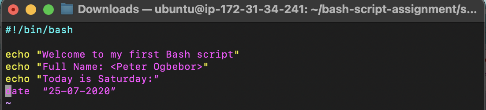

---

#### Screenshot 2 — Output of `./first-script.sh`

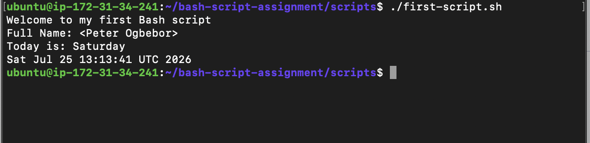

---

#### Screenshot 3 — Output of `ls -l first-script.sh` showing executable permission

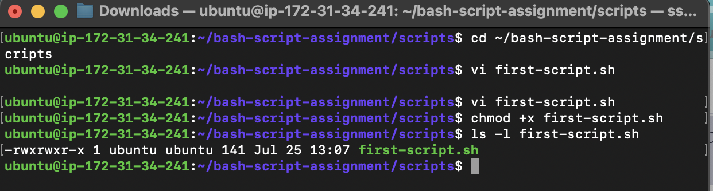

---

### Notes

Answer the following in your own words:

**1. What is the purpose of `#!/bin/bash`?**

#!/bin/bash is a shebang line. It goes on the first line of a script and tells the operating system which interpreter to use to run the file — in this case, /bin/bash.

When you run a script with ./first-script.sh, the kernel reads that first line and hands the rest of the file to /bin/bash to execute, rather than trying to run it as a binary or guessing which shell to use. Without it, the script would fall back to whatever shell is currently running it (if you invoke it as sh script.sh or bash script.sh directly), which can behave differently since not all shells support the same syntax.

---

**2. Why do we use `chmod +x` before running a script?**

chmod +x gives the file execute permission. On Linux, a file needs the execute bit set before you can run it directly as a program (e.g. ./first-script.sh) — without it, the kernel refuses with a "permission denied" error even if the file contains valid, readable script code.

That's also why the shebang (#!/bin/bash) only matters once the file is executable: the kernel needs both permission to execute the file and the shebang to know which interpreter to hand it to.

---

**3. What is the difference between running a script using `./script.sh` and `bash script.sh`?**

./script.sh executes the file directly. This requires the execute permission (chmod +x) to be set, and it relies on the shebang line (#!/bin/bash) to tell the kernel which interpreter to use. The ./ prefix is needed because the current directory usually isn't in your $PATH, so you have to point explicitly to the file.

bash script.sh runs the script by explicitly invoking bash and passing the script as an argument. Execute permission isn't required — bash just reads the file as input, the same way it would read any text file. The shebang line is ignored in this case, since you're already telling the system which interpreter to use.

---

# Task 3 — Variables: User Information Script

## Goal

Use variables to store and display user-related information.

### Evidence

#### Screenshot 1 — Content of `user-info.sh`

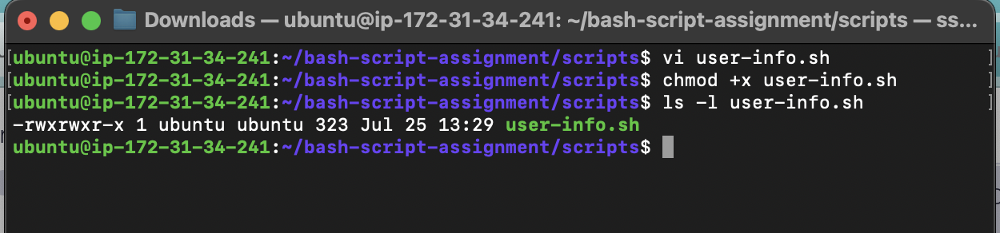

---

#### Screenshot 2 — Output of `./user-info.sh`

---

### Notes

Answer the following in your own words:

**1. What is a variable in Bash?**

A variable in Bash is a name that holds a value text, a number, or the output of a command which you can reference later in the script.

---

**2. Why should we avoid spaces around the `=` sign when creating variables?**

In Bash, spaces are how the computer separates commands from arguments.

When you run a command like mkdir new_folder, Bash knows mkdir is the action and new_folder is the target because a space sits between them.

If you put spaces around the = sign, you confuse Bash about what you're trying to do:

If you write name = "Alex"

Bash thinks you are trying to run a program called name, and handing it = and "Alex" as options. Since there is no program named "name," it gives you a command not found error.

If you write name= "Alex"

Bash treats name= as a temporary background setting, and then tries to run "Alex" as a program to execute. Again, it fails because "Alex" isn't a command.

Writing name="Alex" with no spaces keeps everything glued together as one single thought, telling Bash: "I'm not trying to run a program right now—just save this value into this variable."

---

**3. How do you access the value stored inside a Bash variable?**

You access the value stored inside a Bash variable by placing a dollar sign ($) before the variable name. for example;

name="Peter"
echo $name

The $ tells Bash to retrieve the value stored in the variable instead of treating it as plain text.
---

# Task 4 — Arrays & Loops: Tools Checklist Script

## Goal

Use arrays and loops to print a checklist of tools used in Bash scripting.

### Evidence

#### Screenshot 1 — Content of `tools-checklist.sh`

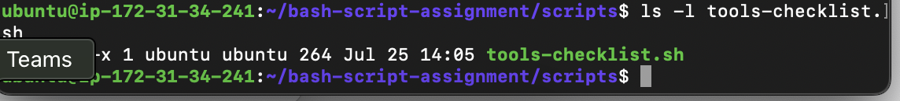

---

#### Screenshot 2 — Output of `./tools-checklist.sh`

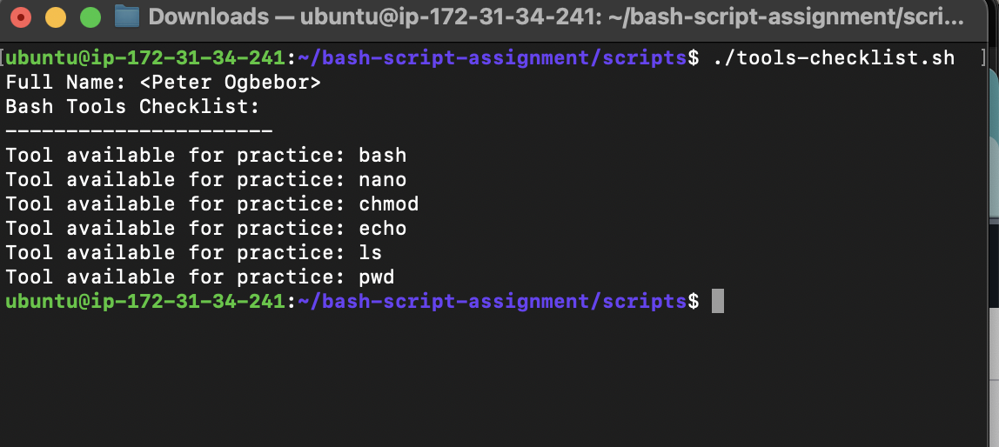

---

### Notes

Answer the following in your own words:

**1. What is an array in Bash?**

An array in Bash is a variable that can store multiple values under a single name instead of just one value. Each value is stored at a different index, starting from 0. for example 

fruits=("Apple" "Banana" "Orange")

echo ${fruits[0]}

the output will be 

Apple

the fruits array contains three values, and ${fruits[0]} accesses the first item, which is Apple.
---

**2. Why are arrays useful in scripts?**

Arrays are useful in Bash scripts because they allow you to store and manage multiple related values in a single variable. This makes scripts more organized and easier to work with, especially when processing lists of items.

---

**3. What does `"${tools[@]}"` mean?**

"${tools[@]}" is used to access all the elements in the tools array. Each element is treated as a separate value, which is useful when looping through an array or passing all its items to a command.

---

**4. What is the purpose of the `for` loop in this script?**

The purpose of the 'for' loop is to repeat a block of code for each item in a list or array. It helps automate repetitive tasks instead of writing the same code multiple times.

---

# Task 5 — Loops: Number Counter Script

## Goal

Use loops to repeat a task multiple times.

### Evidence

#### Screenshot 1 — Content of `counter.sh`

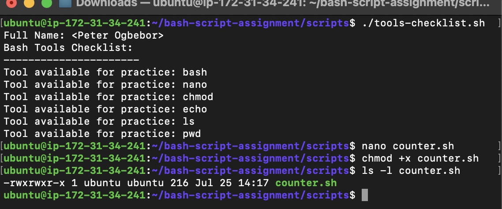

---

#### Screenshot 2 — Output of `./counter.sh`

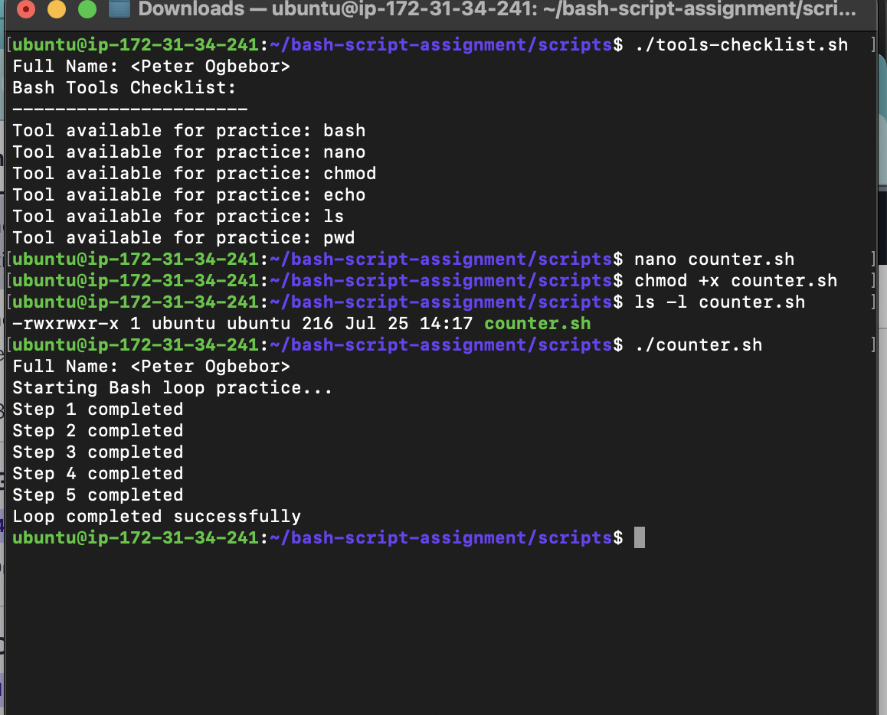

---

### Notes

Answer the following in your own words:

**1. What is a loop?**

A loop is a programming structure that repeats a block of code until all items have been processed or a condition is met. It helps automate repetitive tasks and reduces the need to write the same code multiple times. For example, in Bash, a for loop can go through a list of items and perform the same action for each one. This makes scripts simpler, more efficient, and easier to maintain.

---

**2. Why do we use loops in Bash scripting?**

We use loops in Bash scripting to repeat a set of commands automatically. This saves time, reduces repetitive code, and makes scripts easier to manage. For example, a loop can process multiple files, users, or directories one by one without having to write the same command repeatedly. This makes the script more efficient and easier to maintain.

---

**3. How many times did the loop run in your script?**

The loop ran 3 times because the array contained 5 elements. The for loop executed once for each element in the array.

In general, a for loop runs once for each item in the array or list it is processing.

---

**4. What would you change if you wanted the loop to run 10 times?**

If I wanted the loop to run 10 times, I would use a sequence of numbers instead of an array with three items. 

for i in {1..10}
do
  echo "Iteration $i"
done

This loop will run 10 times, printing the iteration number from 1 to 10.

---

# Task 6 — Files & Conditionals: File Validation Script

## Goal

Use file checks and conditionals to verify whether files and directories exist.

### Evidence

#### Screenshot 1 — Output of `ls -lah ../test-folder`

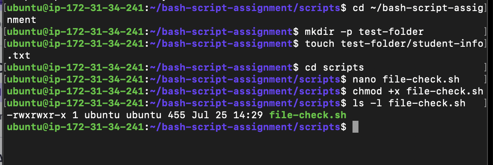

---

#### Screenshot 2 — Content of `file-check.sh`

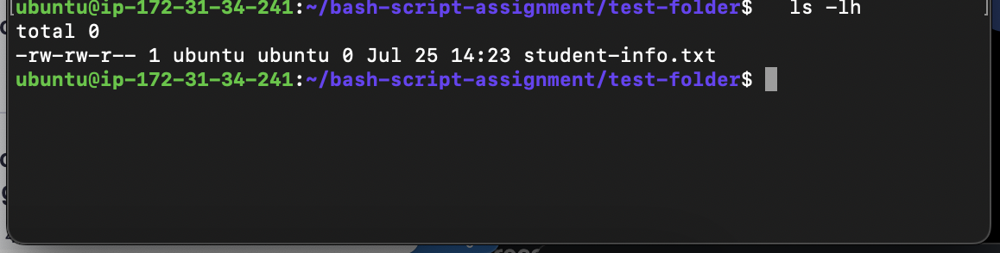

---

#### Screenshot 3 — Output of `./file-check.sh`

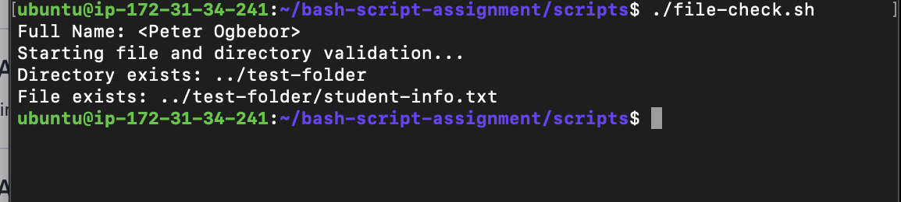

---

### Notes

Answer the following in your own words:

**1. What does `-d` check in Bash?**

In Bash, -d checks whether a directory exists.

It is commonly used in an if statement to test if a specified path is a directory before running commands.

if in any situation, -d returns true if the Directory folder exists; otherwise, it returns false.

---

**2. What does `-f` check in Bash?**

In Bash, -f checks whether a regular file exists.

It is often used in an if statement to verify that a file exists before performing operations on it.

if in any situation -f returns true if the file exists and is a regular file; otherwise, it returns false.

---

**3. Why should file and directory paths be stored in variables?**

File and directory paths should be stored in variables because it makes the script easier to read, update, and maintain. If the path changes, you only need to update the variable instead of changing it everywhere in the script.

Using variables also reduces errors and makes the script more organized and reusable.

---

**4. What happens if the file does not exist?**

If the file does not exist, the -f test returns false, and the commands inside the if statement are skipped. If there is an else block, Bash executes the commands in the else section instead.

---

# Task 7 — Conditionals: Pass or Retry Script

## Goal

Use if-else conditionals to make decisions based on a variable value.

### Evidence

#### Screenshot 1 — Content of `score-check.sh` with `score=85`

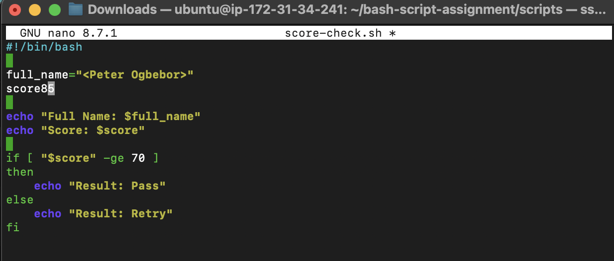

---

#### Screenshot 2 — Output showing `Result: Pass`

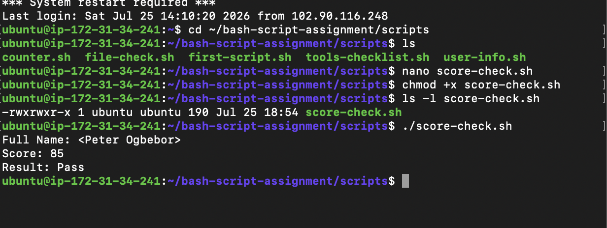

---

#### Screenshot 3 — Content of `score-check.sh` with `score=55`

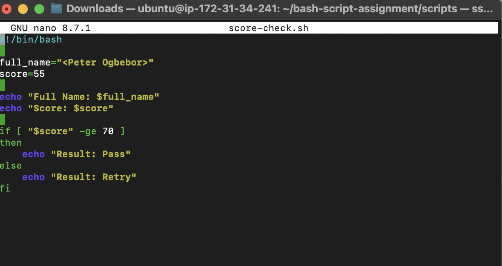

---

#### Screenshot 4 — Output showing `Result: Retry`

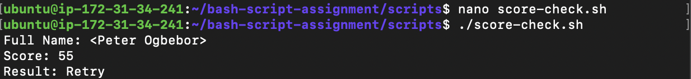

---

### Notes

Answer the following in your own words:

**1. What is the purpose of if-else in Bash?**

The purpose of an if-else statement in Bash is to make decisions based on a condition. If the condition is true, Bash executes the commands in the if block. If the condition is false, it executes the commands in the else block.

This allows a script to respond differently depending on different situations, such as whether a file or directory exists.

---

**2. What does `-ge` mean?**

-ge is a comparison operator in Bash that means greater than or equal to. It is used to compare two integer values. for example 
num=10

if [ "$num" -ge 5 ]; then
    echo "The number is greater than or equal to 5."
fi

In this example, the condition is true because 10 is greater than 5, so the message is displayed.

---

**3. Why should conditions be tested with different values?**

Conditions should be tested with different values to make sure the script works correctly in different situations. This helps confirm that both the true and false parts of the condition behave as expected.

Testing different values also helps find errors and makes the script more reliable.

---

**4. How can conditionals help in automation scripts?**

Conditionals help in automation scripts by allowing the script to make decisions based on different conditions. The script can perform different actions depending on whether a condition is true or false.

For example, a script can check if a file exists before copying it or verify if a service is running before restarting it. This makes automation scripts smarter, more reliable, and able to handle different situations automatically.

---

# Task 8 — Functions: Final Bash Automation Script

## Goal

Create a final Bash script using functions to organize reusable code.

### Evidence

#### Screenshot 1 — Content of `final-automation.sh`

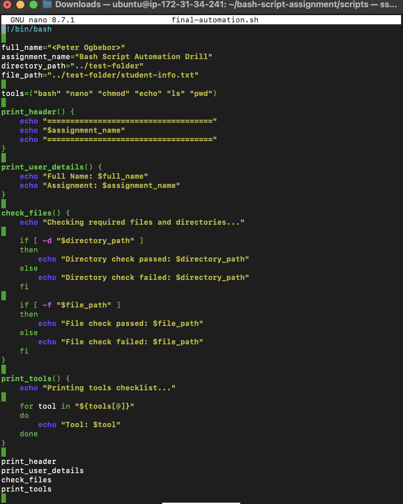

---

#### Screenshot 2 — Output of `./final-automation.sh`

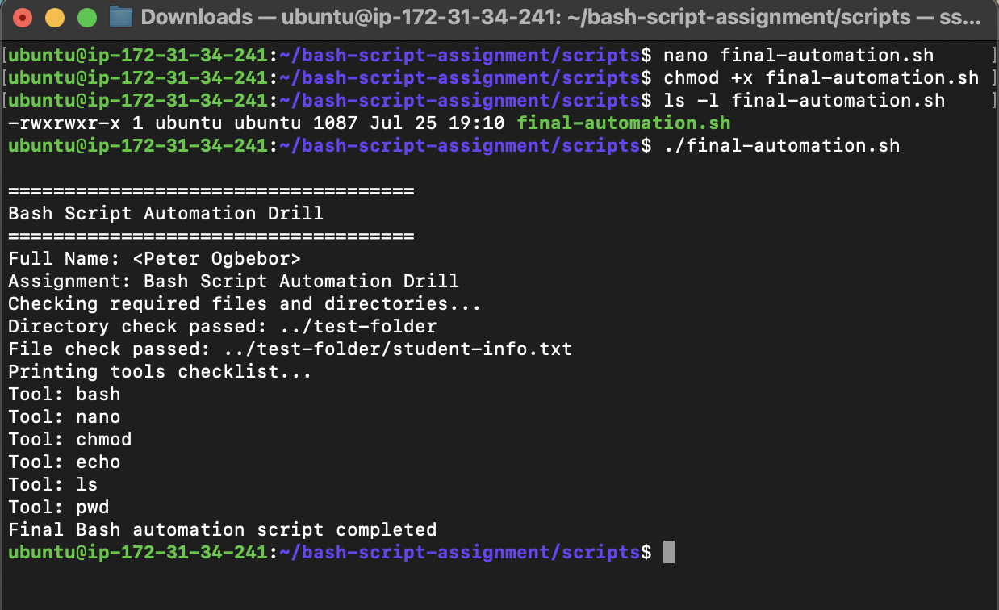

---

#### Screenshot 3 — Output of `ls -lah` showing all created scripts

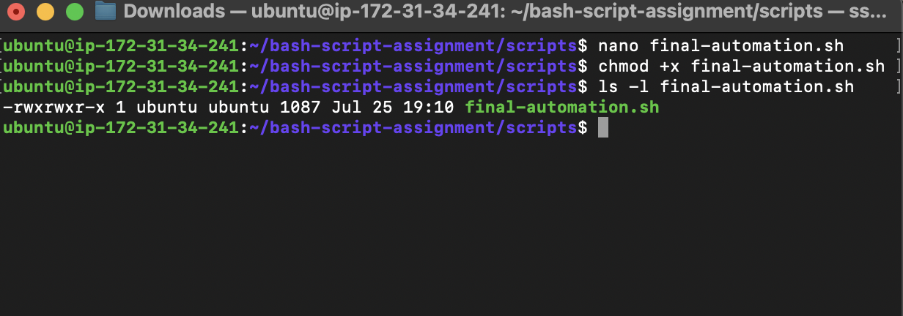

---

### Notes

Answer the following in your own words:

**1. What is a function in Bash?**

A function in Bash is a reusable block of code that performs a specific task. Instead of writing the same commands multiple times, you can place them inside a function and call the function whenever you need it.

---

**2. Why are functions useful in scripts?**

Functions are useful in scripts because they allow you to reuse the same block of code whenever it is needed. This reduces repetition, makes the script easier to read, and simplifies maintenance.

If you need to change how a task is performed, you only have to update the function once instead of changing the same code in multiple places. This makes scripts more organized and efficient.

---

**3. Which functions did you create in this script?**

print_header

print_user_details

check _files

print_tools

---

**4. How does this final script combine variables, arrays, loops, conditionals, files, and functions?**

The final script combines several Bash features to make it more organized and efficient. It uses variables to store values such as file or directory paths, arrays to store multiple related items, and a loop to process each item in the array automatically. It uses conditionals (if-else) to make decisions, such as checking whether a file or directory exists. It also works with files by verifying that they are available before performing actions. Finally, it uses functions to group reusable code into a single block, making the script easier to read, maintain, and reuse.

---

# LinkedIn Post (Required)

## Evidence

#### LinkedIn Post URL

https://www.linkedin.com/posts/ogbebor-peter-304714109_devops-linux-bashscripting-ugcPost-7486886472319528960-hwr2/?utm_source=share&utm_medium=member_desktop&rcm=ACoAABtWEbQBVvapHtdERI7aOs2eM5g9kkTrmYs

---

#### Screenshot — Published LinkedIn post

---

# Submission Instructions

- Add all required screenshots in your submission
- Full name must be visible in required screenshots
- All script files must be created and run successfully
- Required notes must be answered clearly for every task
- Do not expose sensitive information (keys, passwords, credentials)

---

# Completion Checklist

- [ ] Task 1: Environment setup verified, workspace created (Screenshots 1–2, Notes answered)
- [ ] Task 2: First script created, executed, permissions verified (Screenshots 1–3, Notes answered)
- [ ] Task 3: Variables script created and run (Screenshots 1–2, Notes answered)
- [ ] Task 4: Arrays and loops script created and run (Screenshots 1–2, Notes answered)
- [ ] Task 5: Counter loop script created and run (Screenshots 1–2, Notes answered)
- [ ] Task 6: File validation script created and run (Screenshots 1–3, Notes answered)
- [ ] Task 7: Pass/Retry conditional script tested with both values (Screenshots 1–4, Notes answered)
- [ ] Task 8: Final automation script created and run (Screenshots 1–3, Notes answered)
- [ ] All scripts run without errors
- [ ] Full Name visible in all required screenshots
- [ ] LinkedIn post published and URL submitted
- [ ] No sensitive data exposed

---

## 📌 About DMI & CloudAdvisory

DevOps Micro Internship (DMI) is a project-based DevOps program run by Pravin Mishra (The CloudAdvisory) focused on real-world execution, systems thinking, and career readiness.

It helps learners build strong DevOps foundations with hands-on experience.

---

## 📌 Resources

- 🌐 DMI Official Website: https://dmi.pravinmishra.com?utm_source=github&utm_medium=readme  
- 🎓 University: https://university.pravinmishra.com?utm_source=github&utm_medium=readme  
- 💬 Discord Community: https://discord.pravinmishra.com?utm_source=github&utm_medium=readme  
- 📝 Blog: https://dmi.pravinmishra.com/blog?utm_source=github&utm_medium=readme  
- ▶️ YouTube Playlist: https://www.youtube.com/playlist?list=PLFeSNDtI4Cho  
- 🔗 Pravin Mishra (LinkedIn): https://www.linkedin.com/in/pravin-mishra-aws-trainer/  
- 🏢 CloudAdvisory (LinkedIn): https://www.linkedin.com/company/thecloudadvisory/

---

*This submission is part of DevOps Micro Internship (DMI) Cohort 3 — Agentic AI Track.*