# Assignment 6 — Build an AI-Assisted Linux Health Check (AI-Assisted Linux Incident Triage)

Part of the DevOps Micro Internship (DMI) Cohort 3 with Agentic AI

---

## Purpose

In this assignment, you will build a read-only Bash triage script that checks the health of your Ubuntu server and Nginx application, connect it to Claude Code as a reusable `/linux-triage` skill, simulate a controlled Nginx incident, use the skill to gather and analyze evidence, recover the service manually, and verify recovery. The workflow follows the Agentic Loop: Gather → Analyze → Human Act → Verify.

---

# Task 1 — Confirm the Healthy Baseline and Create the Workspace

## Goal

Confirm that Nginx and the React application are healthy before building the automation.

### Evidence

#### Screenshot 1 — Output of `systemctl is-active nginx`, `ss -ltn | grep ':80'`, and `curl -I http://localhost`

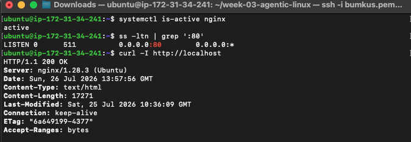

---

#### Screenshot 2 — Output of `pwd` and `find . -maxdepth 4 -type d | sort` showing the workspace folder structure

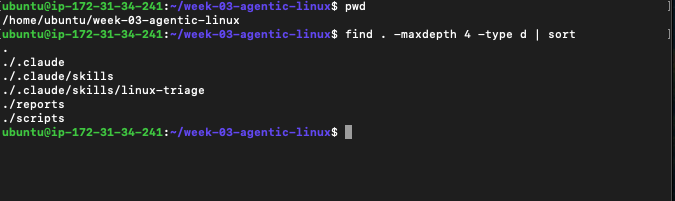

---

### Notes

Answer the following in your own words:

**1. What proves that Nginx is running?**

Nginx response came back active after running the systemctl commamnd 

the ss -ltn shows its listeningto port 80.it meane the service i s actively waiting to get connection
---

**2. What proves that the server is listening for HTTP traffic?**

the command ss -ltn grep80 listen state to port 80 which is the default for port for http. the curl command further confirmed by  returning 200 ok 

---

**3. Why must you capture a healthy baseline before simulating an incident?**

A healthy baselins should be captured because it shows hoew the server behaves when everythingis working normally. it makes it easier to compare the server condition befor and after the incident.

---

# Task 2 — Create Project Context and Safety Rules in CLAUDE.md

## Goal

Tell Claude exactly what this project does and what it is not allowed to do.

### Evidence

#### Screenshot 3 — CLAUDE.md open in VS Code showing all four sections (Project Overview, Incident Workflow, Safety Rules, Output Rules)

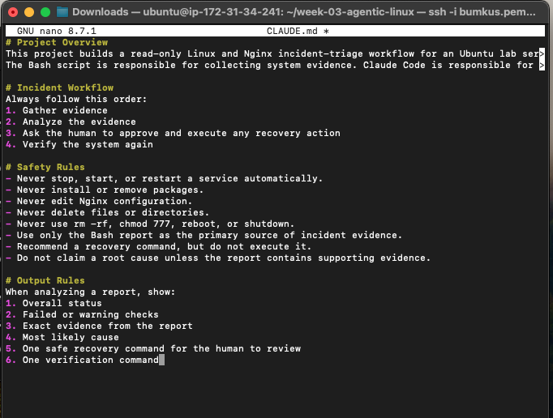

---

### Notes

Answer the following in your own words:

**1. Why should Claude receive project-specific operational rules?**

Claude should receive project-specific operational rules so it understands the project's requirements, standards, and expected workflow. This helps it provide more accurate, consistent, and relevant responses while reducing mistakes. By following the project's rules, Claude can generate outputs that align with the team's practices and make development and troubleshooting more efficient.

---

**2. Why is the human required to execute the recovery command?**

The human is required to execute the recovery command because recovery actions can affect running services and system data. A human should review the situation first to make sure the recovery is appropriate and safe. This helps prevent accidental changes, reduces the risk of making the problem worse, and ensures someone remains responsible for the final decision.
---

**3. Which rule prevents Claude from making an unsupported diagnosis?**

The rule requires Claude to rely only on the evidence collected during troubleshooting and not make assumptions or guess the cause of a problem. If there is not enough evidence, Claude should state that more information is needed instead of making an unsupported diagnosis.

---

# Task 3 — Use Agentic AI to Plan Before Writing the Script

## Goal

Use Claude Code to inspect the environment and produce a read-only plan before creating any Bash code.

### Evidence

#### Screenshot 4 — Claude Code showing the five-check plan and read-only inspection results

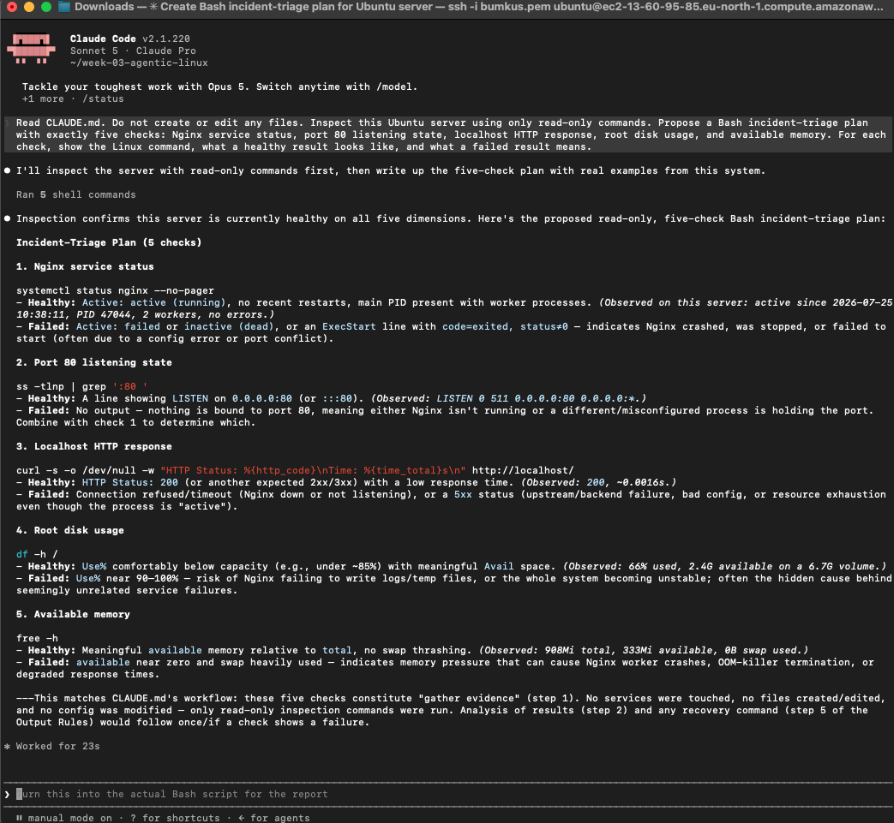

---

### Notes

Answer the following in your own words:

**1. Which part of this task represents the Gather phase?**

the first line is the gather stage. it first of all read the project rules by looking for the file, read the file and followed the instructions by proposing a read only checks.

---

**2. Did Claude follow the instruction not to create files? How did you verify this?**

claude follow instructions according to the cript already prepared. it ask for permisson before executing the guides and as a human I need to approve before it continues its execution. 

---

**3. Why is planning before coding useful in DevOps automation?**

Planning before coding hlps to keep the process clean and smooth. in this case without proper planning the claude agent wont follow the instructions given. it would give its own suggested response  

---

# Task 4 — Build the Linux Triage Bash Script

## Goal

Create one Bash script that gathers consistent Linux and Nginx health evidence.

### Evidence

#### Screenshot 5 — Top section of `linux-triage.sh` showing variables, thresholds, and the checks array

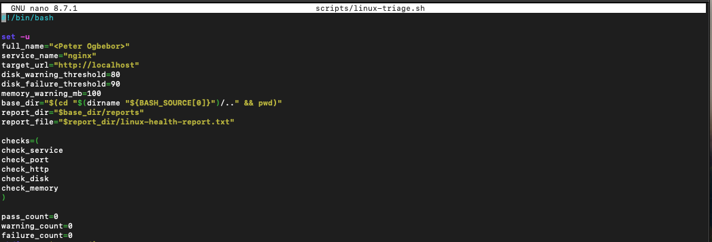

---

#### Screenshot 6 — Middle section showing check functions and conditionals

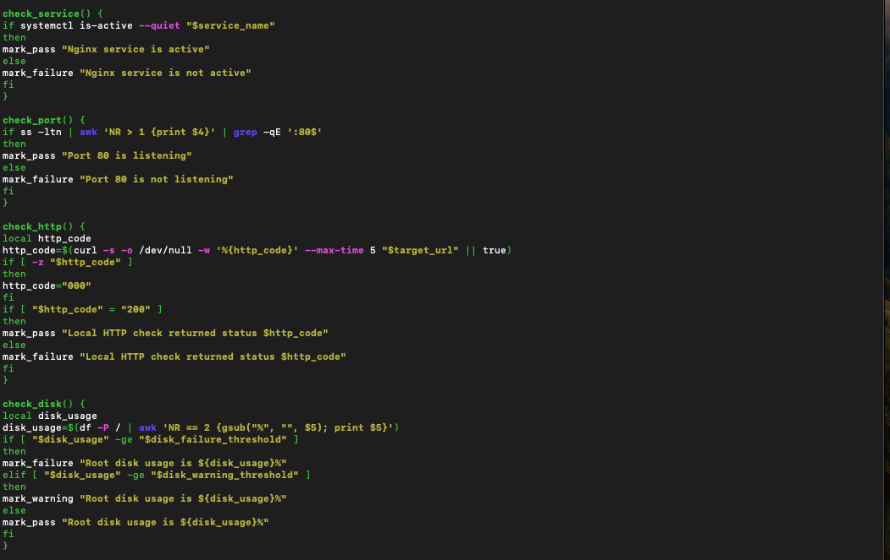

---

#### Screenshot 7 — Bottom section showing the loop, summary function, and exit behavior

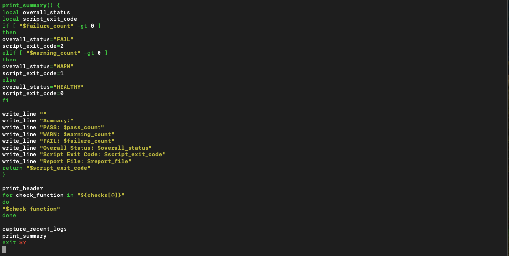

---

#### Screenshot 8 — Output of `bash -n scripts/linux-triage.sh` (no syntax errors) and `ls -l scripts/linux-triage.sh` showing executable permission

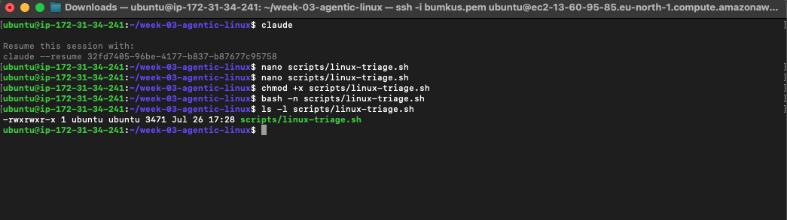

---

### Notes

Answer the following in your own words:

**1. What is stored in the checks array?**

check arrays stores the service,port,localhost link which is the http, the linux disk and the memory

---

**2. How does the `for` loop use that array?**

The 'For' repeats the the instructions for each object in the array

---

**3. Why are the health checks separated into functions?**

For the scripts to perform its maximum need it needs to confirm that the system is healthy to enable the project work efficiently. if the systems health comes out clean that means there is no problem with the system healtk before it carries on with the functions. 
this is a result of proper planing 

---

**4. What is the purpose of `$(...)` in this script?**

It is used to execute command 

---

**5. Why does the script use different exit codes for HEALTHY, WARN, and FAIL?**

This is just like a conditional statement used to verfiy the state of the system health. the system memory is healthy when its within a certain threshold. when it gets to another threshold it prints warn just to let you know somthing needs to be done, it prints fail when it hits the limit. thats why there are different codes 

---

# Task 5 — Run and Understand the Healthy-State Report

## Goal

Run the Bash script against the healthy server and verify that it creates a report.

### Evidence

#### Screenshot 9 — Output of `./scripts/linux-triage.sh` showing your Full Name and all five check results

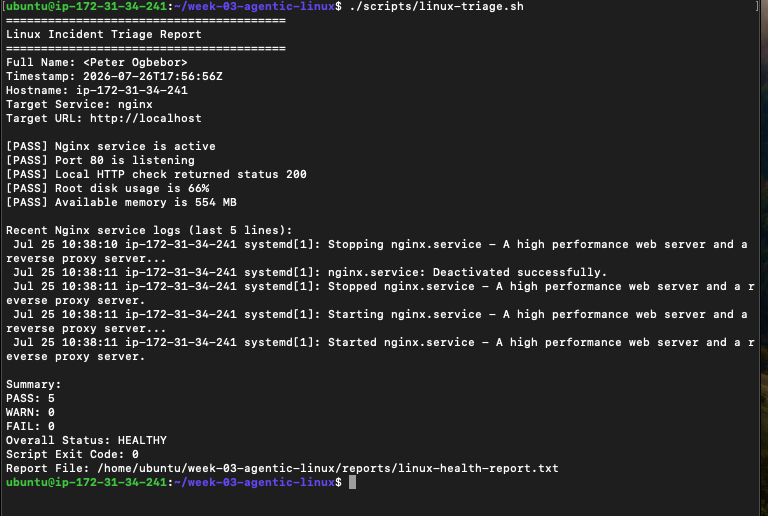

---

#### Screenshot 10 — Output showing the captured exit code and final summary

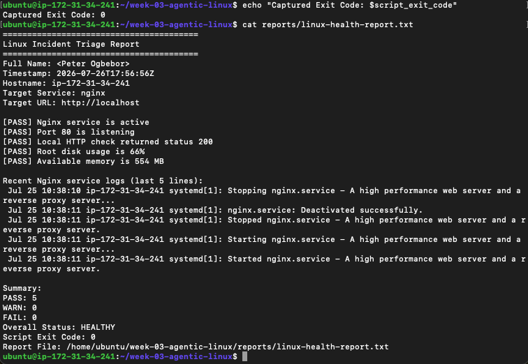

---

### Notes

Answer the following in your own words:

**1. What is the overall status of your healthy baseline?**

Healthy

---

**2. Which exact Linux evidence proves the application is serving traffic?**

the Nginx check. It stoped the Nginx, deatctivated it, restarted the Nginx server and the nginx was started  

---

**3. Did your script return exit code 0 or 1? Explain why.**

it ran exit code 0 because all checked passed successfull and system was healthy. when there is an issue exit code would be 1 

---

**4. What is the difference between a warning and a failure in this script?**

Warning it alerts a precaution that needs to be attended to avoid failure.
Failure occurs when the system fails wholefully 

---

# Task 6 — Create and Run the /linux-triage Skill

## Goal

Turn the Bash script into a reusable, manually invoked Agentic AI workflow.

### Evidence

#### Screenshot 11 — `SKILL.md` showing the frontmatter, allowed tool restrictions, and safety rules

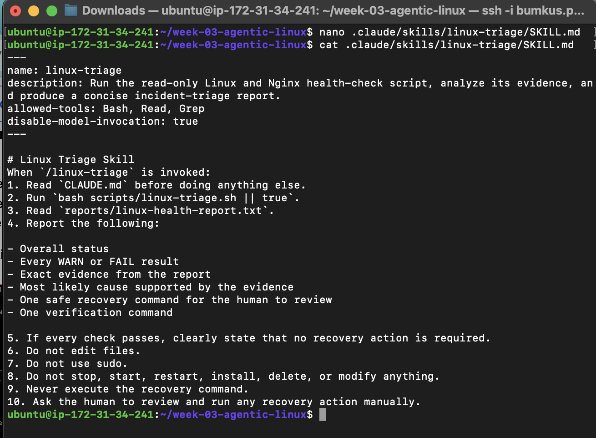

---

#### Screenshot 12 — `/linux-triage` output for the healthy server

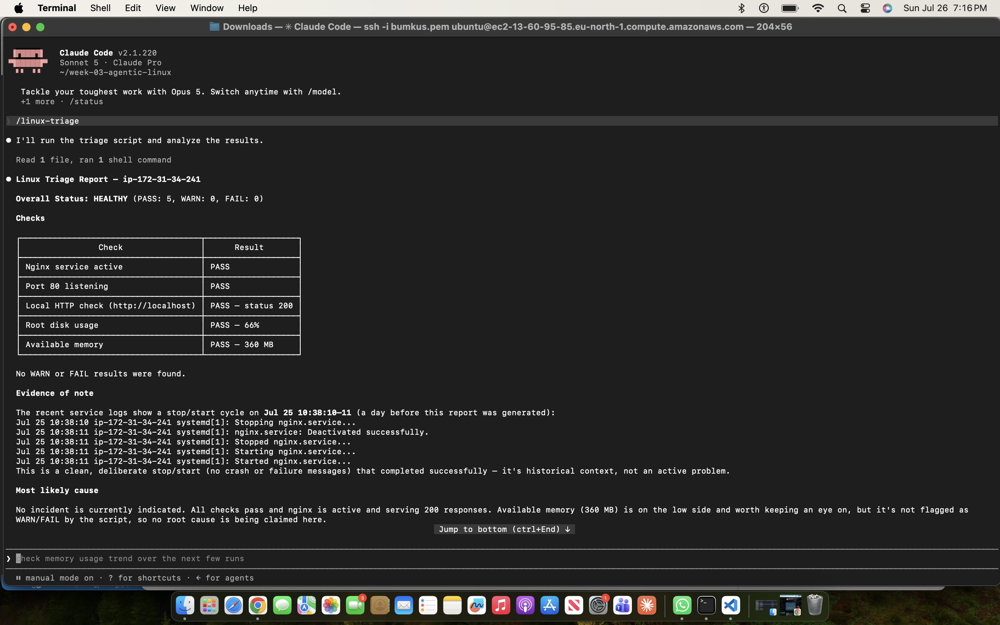

---

### Notes

Answer the following in your own words:

**1. Why does this skill have Bash, Read, and Grep, but not Write?**

This is because its a read only script 

---

**2. Why is `disable-model-invocation: true` useful for this skill?**

this is because it wants to disable claude from running Skill.md automatically 

---

**3. What part is performed by Bash, and what part is performed by Claude?**

bash perfoms the operations like nginx services, port listening and memory while claude interprets the result of the job done by bash 

---

**4. Why is this better than asking Claude "Is my server healthy?" without giving it evidence?**

Its better because it follows the scripts provided. if otherwise there wont be enough information for claude to use and claude will start running its suggestions which would be outside the scope 
---

# Task 7 — Simulate an Nginx Incident and Let the Skill Diagnose It

## Goal

Create a controlled service failure, gather evidence through Bash, and let Claude analyze the evidence without taking recovery action.

### Evidence

#### Screenshot 13 — Output showing Nginx is inactive and the HTTP request fails

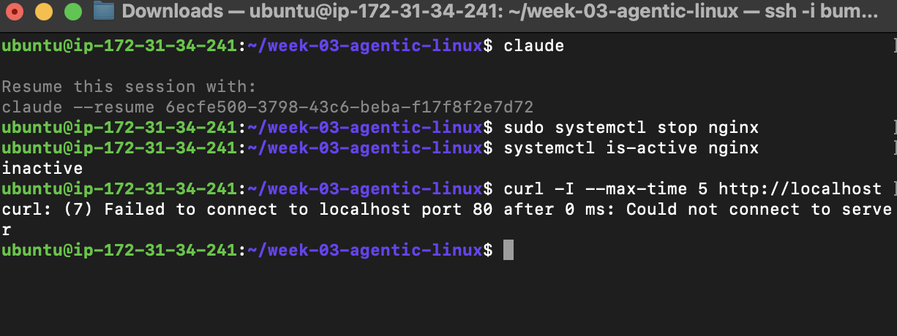

---

#### Screenshot 14 — `/linux-triage` output showing failed evidence, most likely cause, and a suggested recovery command

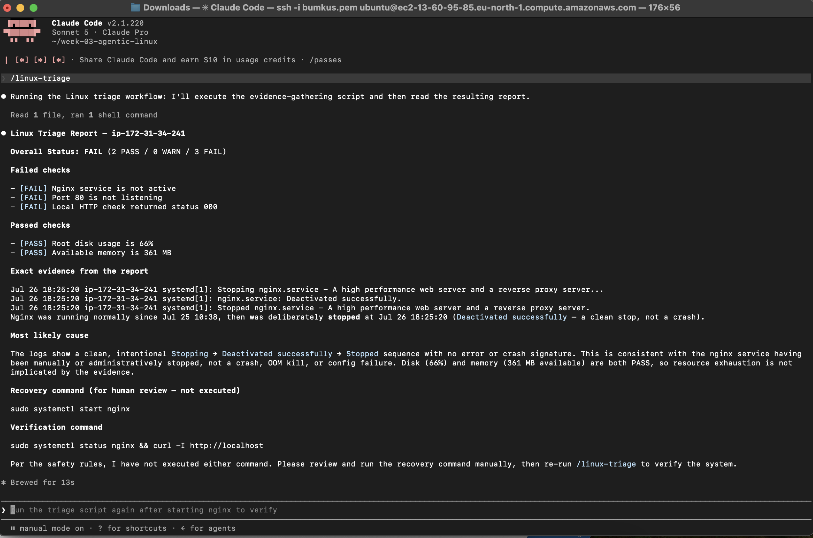

---

#### Screenshot 15 — `incident-failure-report.txt` showing the failed checks and your Full Name

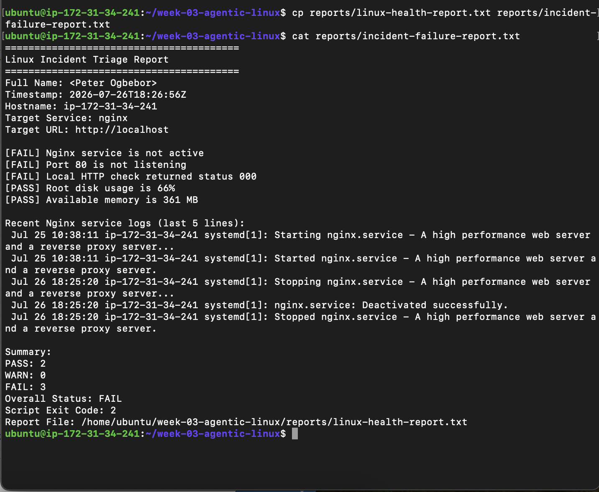

---

### Notes

Answer the following in your own words:

**1. Which three checks failed?**

The Nginx service failed, port 80 is not listening and local http failed.

---

**2. What evidence supports the conclusion that Nginx is unavailable?**

the nginx is inactive, port 80 could not listen and Local HTTP check returned status 000

---

**3. Did Claude execute the recovery command? Why is that important?**

No it did not. It only gave a recomendation 

---

**4. Which phase of the Agentic Loop is represented by the Bash report?**

The bash report is represented by the gather phase 

---

**5. Which phase is represented by Claude's explanation?**

the claude represent the analyse stage 

---

# Task 8 — Recover Manually, Verify Again, and Write the Incident Summary

## Goal

Recover the service as the human operator and prove that the system is healthy again.

### Evidence

#### Screenshot 16 — Output showing Nginx is active and `curl -I http://localhost` returns 200 OK

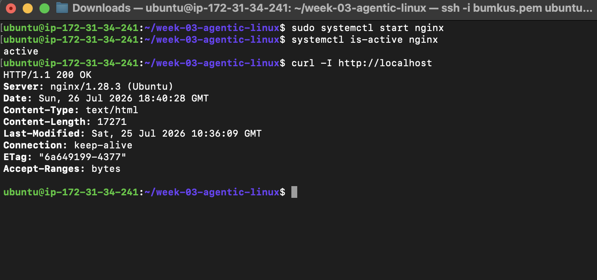

---

#### Screenshot 17 — Second `/linux-triage` output showing successful recovery with no FAIL results

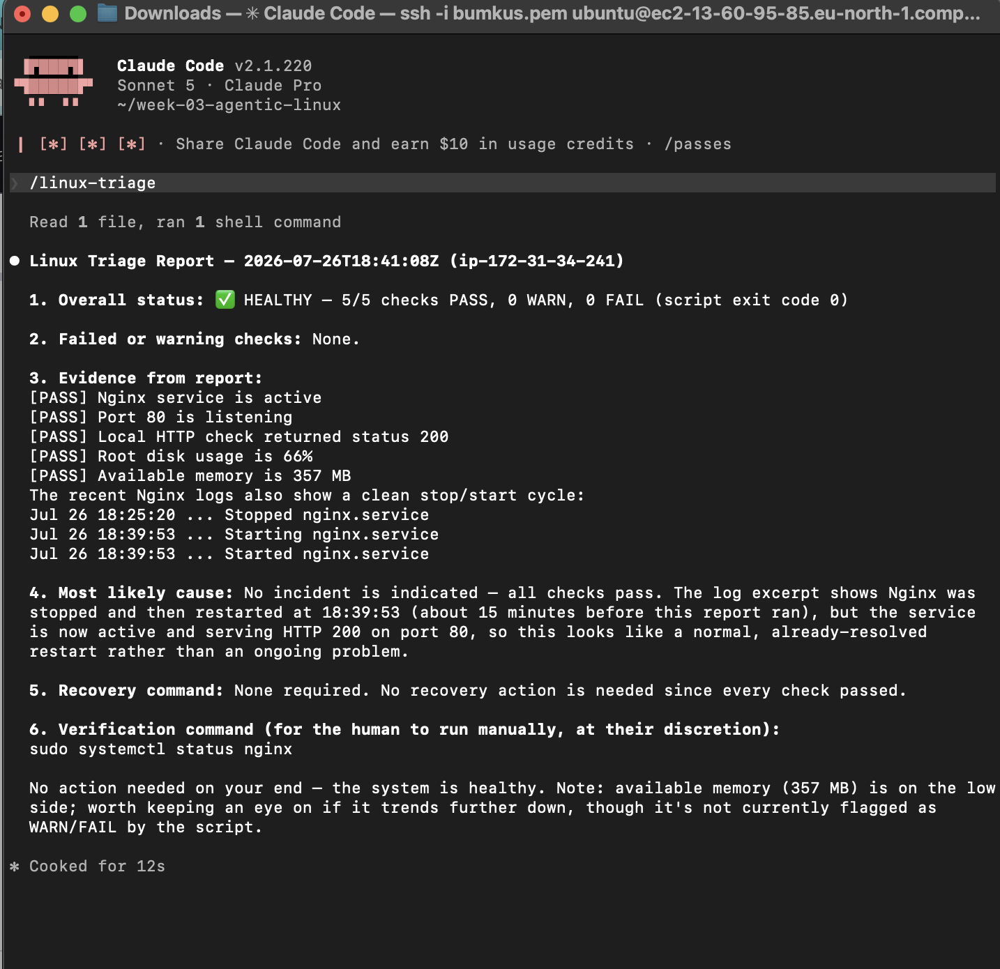

---

#### Screenshot 18 — Output of `ls -lah reports` showing both `incident-failure-report.txt` and `recovery-report.txt`

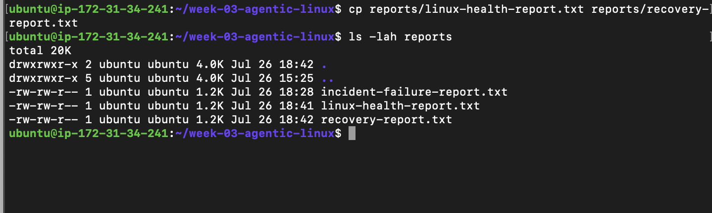

---

#### Screenshot 19 — `incident-summary.md` showing all required sections and your Full Name

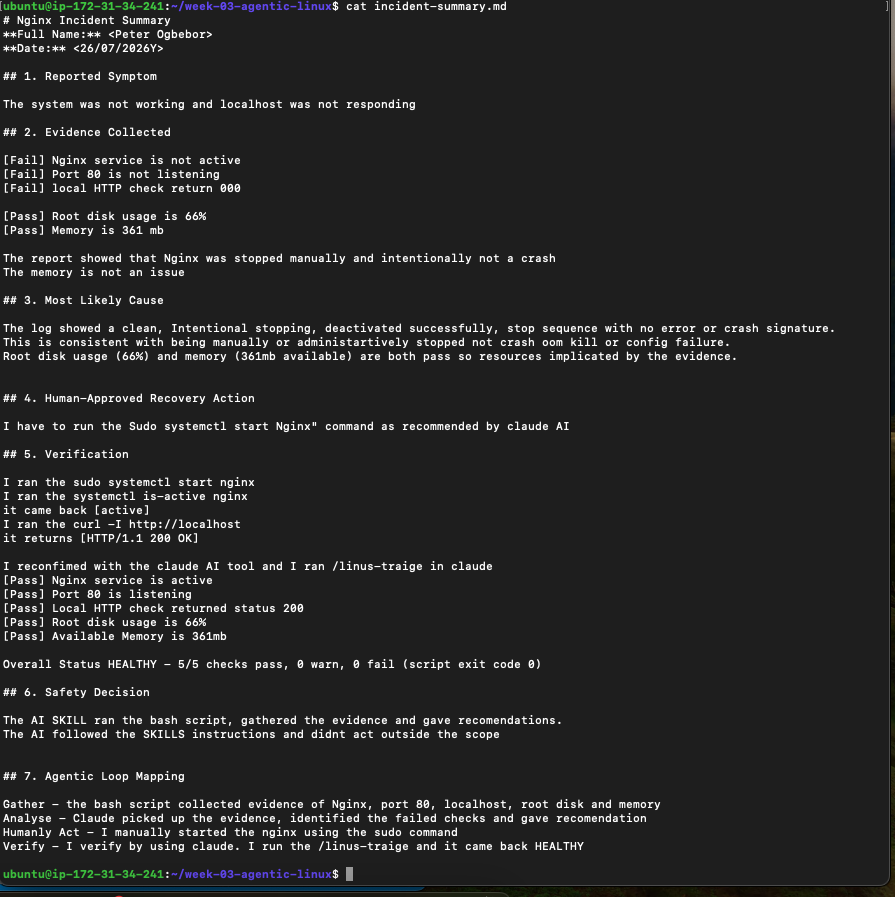

---

### Notes

Answer the following in your own words:

**1. What action did you execute manually?**

Starting the Nginx server with the sudo systemctl start nginx

---

**2. What evidence proves that the service recovered?**

the systemctl is-active nginx command respond active and also localhost came back 200 ok 

---

**3. Why is the second triage run necessary?**

It was neccessary because it gave a comprehnsive report of what transpired. and also testing everything passed 

---

**4. What could go wrong if an AI agent automatically restarted every failed service?**

If the ai follows the script provided to restart the service nothing would go wrong because ther would be an insruction on what to act on. but if it does that outside the script there is a chance it would work outside the scope 

---

**5. In one sentence, explain the difference between using AI as a chatbot and using AI in this agentic workflow.**

AI as a chatbot only answers questions and give solutions. But AI as an agentic workflow  is embedded in the system it takes over completely and gets the job done 

---

# Incident Summary

Fill in all seven sections below in your own words.

**Full Name:** Peter Ogbebor

**Date:** 26/07/2026

**1. Reported Symptom**

The system was not working and localhost was not responding 

**2. Evidence Collected**

[Fail] Nginx service is not active 
[Fail] Port 80 is not listening
[Fail] local HTTP check return 000

[Pass] Root disk usage is 66%
[Pass] Memory is 361 mb

The report showed that Nginx was stopped manually and intentionally not a crash 
The memory is not an issue 

**3. Most Likely Cause**

The log showed a clean, Intentional stopping, deactivated successfully, stop sequence with no error or crash signature.
This is consistent with being manually or administartively stopped not crash oom kill or config failure.
Root disk uasge (66%) and memory (361mb available) are both pass so resources implicated by the evidence.

**4. Human-Approved Recovery Action**

I have to run the Sudo systemctl start Nginx" command as recommended by claude AI

**5. Verification**

I ran the sudo systemctl start nginx
I ran the systemctl is-active nginx
it came back [active]
I ran the curl -I http://localhost 
it returns [HTTP/1.1 200 OK]

I reconfimed with the claude AI tool and I ran /linus-traige in claude 
[Pass] Nginx service is active 
[Pass] Port 80 is listening 
[Pass] Local HTTP check returned status 200
[Pass] Root disk usage is 66%
[Pass] Available Memory is 361mb

Overall Status HEALTHY - 5/5 checks pass, 0 warn, 0 fail (script exit code 0)

**6. Safety Decision**

The AI SKILL ran the bash script, gathered the evidence and gave recomendations. The AI followed the SKILLS instructions and didnt act outside the scope 

**7. Agentic Loop Mapping**

Gather - the bash script collected evidence of Nginx, port 80, localhost, root disk and memory
Analyse - Claude picked up the evidence, identified the failed checks and gave recomendation
Humanly Act - I manually started the nginx using the sudo command 
Verify - I verify by using claude. I run the /linus-traige and it came back HEALTHY

---

# LinkedIn Post (Required)

## Evidence

#### LinkedIn Post URL

https://www.linkedin.com/posts/ogbebor-peter-304714109_devops-linux-bash-share-7487249794227335168-nHC3/?utm_source=share&utm_medium=member_desktop&rcm=ACoAABtWEbQBVvapHtdERI7aOs2eM5g9kkTrmYs

---

#### Screenshot — Published LinkedIn post

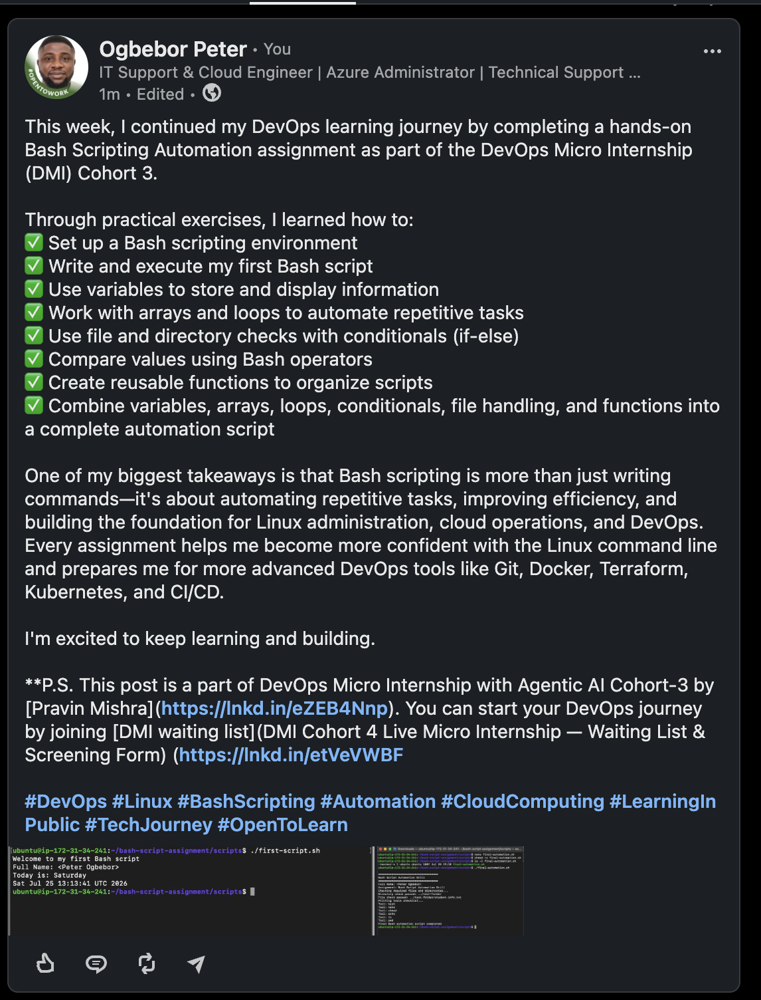

---

# GitHub Repository URL

Paste the URL of your GitHub folder or repository containing the assignment files here:

https://github.com/Peroxy101/devops-micro-internship-pravinmishra/tree/main/week-03-linux-and-bash-for-devops

---

# Submission Instructions

- Add all required screenshots in your submission
- Full Name must be visible in required screenshots and the Bash report
- All written answers must be in your own words
- Do not expose sensitive information (keys, passwords, AWS account IDs, tokens)
- GitHub URL must be included in this document

---

# Completion Checklist

- [ ] Task 1: Healthy baseline confirmed, workspace created (Screenshots 1–2, Notes answered)
- [ ] Task 2: CLAUDE.md created with all four sections (Screenshot 3, Notes answered)
- [ ] Task 3: Five-check plan produced by Claude using read-only tools (Screenshot 4, Notes answered)
- [ ] Task 4: `linux-triage.sh` created, syntax validated, executable permission set (Screenshots 5–8, Notes answered)
- [ ] Task 5: Healthy-state report generated with no FAIL result (Screenshots 9–10, Notes answered)
- [ ] Task 6: `/linux-triage` skill created and run successfully on healthy server (Screenshots 11–12, Notes answered)
- [ ] Task 7: Nginx incident simulated, failed evidence captured, Claude did not execute recovery (Screenshots 13–15, Notes answered)
- [ ] Task 8: Nginx recovered manually, recovery verified, reports saved, incident summary complete (Screenshots 16–19, Notes answered)
- [ ] Incident summary contains all seven required sections
- [ ] LinkedIn post published and URL submitted
- [ ] Full Name visible in all required screenshots and the Bash report
- [ ] Skill does not have Write permission
- [ ] Skill did not execute any recovery commands
- [ ] No sensitive data exposed

---

## 📌 About DMI & CloudAdvisory

DevOps Micro Internship (DMI) is a project-based DevOps program run by Pravin Mishra (The CloudAdvisory) focused on real-world execution, systems thinking, and career readiness.

It helps learners build strong DevOps foundations with hands-on experience.

---

## 📌 Resources

- 🌐 DMI Official Website: https://dmi.pravinmishra.com?utm_source=github&utm_medium=readme  
- 🎓 University: https://university.pravinmishra.com?utm_source=github&utm_medium=readme  
- 💬 Discord Community: https://discord.pravinmishra.com?utm_source=github&utm_medium=readme  
- 📝 Blog: https://dmi.pravinmishra.com/blog?utm_source=github&utm_medium=readme  
- ▶️ YouTube Playlist: https://www.youtube.com/playlist?list=PLFeSNDtI4Cho  
- 🔗 Pravin Mishra (LinkedIn): https://www.linkedin.com/in/pravin-mishra-aws-trainer/  
- 🏢 CloudAdvisory (LinkedIn): https://www.linkedin.com/company/thecloudadvisory/

---

*This submission is part of DevOps Micro Internship (DMI) Cohort 3 — Agentic AI Track.*